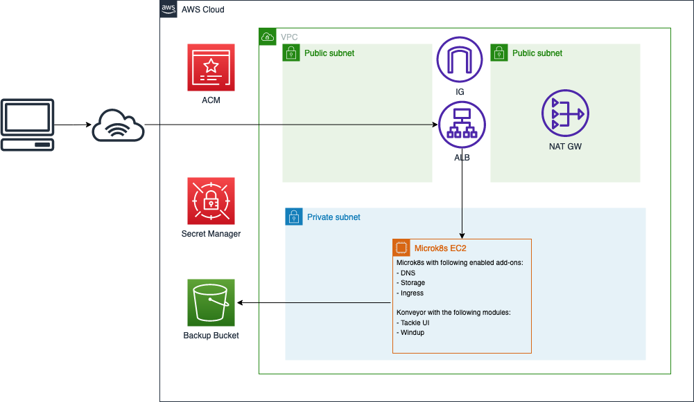

# Konveyor distribution on the AWS Marketplace

This repo is being used by [Claranet Switzerland GmbH](https://claranet.ch) to produce a listing on the AWS Marketplace.

> **Note**
> listing is being reviewed, will add the link as soon as it's available

The goal is to allow anyone to try Konveyor within their organization, even if they don't have a Kubernetes (EKS) cluster available.

# Deployment architecture



# How to build and deploy from sources

## Prerequisites

- Create a "konveyor" aws profile pointing to your AWS account, or use another one by overriding the `aws_profile` variable, see https://developer.hashicorp.com/packer/docs/templates/legacy_json_templates/user-variables for more information
- Download Packer (https://packer.io)

## Build image

```shell
./generate-ami.sh
```
any arguments you pass to this script will be forwarded to `packer`

As soon as the builds complete successfully, a CloudFormation template will be generated under `out/generated-template.yaml`

## Apply infrastructure

In order to apply the infrastructure you'll need the following information:

- _Domain_: an existing (and valid) domain name
- _ACMArn_: The ARN of a valid [ACM](https://aws.amazon.com/certificate-manager/) Certificate

```shell
aws cloudformation deploy --template-file out/generated-template.yaml --capabilities CAPABILITY_IAM --profile konveyor --parameter-overrides Domain=your-domain.com ACMArn=arn:aws:acm:us-east-1:123456789012:certificate/uuid --region us-east-1 --stack-name my-konveyor
```

After deployment completes, you can monitor the initialization process by accessing the EC2 instance using [SSM](https://docs.aws.amazon.com/AWSEC2/latest/UserGuide/session-manager.html) and monitoring the cloud-init-log:

```shell
sudo tail -f /var/log/cloud-init-output
```

## First login

you must define a new password for the `admin` user.

Default is `admin` / `Passw0rd!`

Check the [Konveyor](https://konveyor.github.io/tackle/installation/) docs for more information